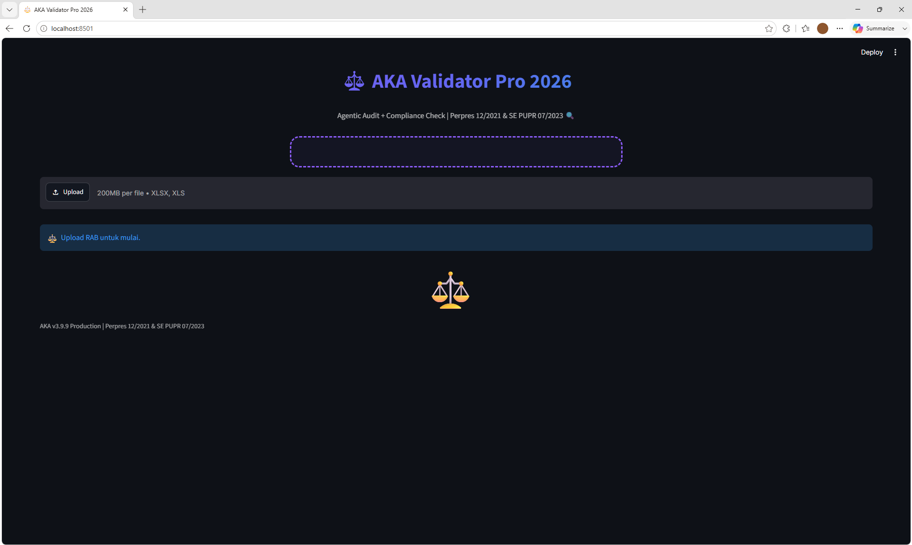

<div align="center">

# ⚖️ AKA Validator Pro 2026
### *Agentic Knowledge Audit for Indonesian Public Procurement*

[](https://www.python.org/downloads/)
[](https://streamlit.io)
[](https://opensource.org/licenses/MIT)

<br>

> **Transformasi Digital Pengadaan Publik.**  
> Dari RAB Penawar yang berantakan, menjadi Laporan Audit & Surat Dinas Resmi dalam hitungan detik.  
> **Sesuai Perpres 12/2021 & SE PUPR 07/2023.**

<br>

[🚀 Mulai Sekarang](#-cara-pakai-untuk-panitia---3-menit) &nbsp;·&nbsp; [📖 Dokumentasi](#-untuk-developer) &nbsp;·&nbsp; [📷 Demo](#-demo)

</div>

---

## ✨ Mengapa AKA Validator Pro?

Di dunia pengadaan, kesalahan aritmatika pada RAB sering kali menjadi biang keladi gugurnya penawaran atau kerugian negara. AKA hadir sebagai **AI Agent** yang bekerja di *background* Anda untuk menyelesaikan masalah ini secara instan.

| Fitur Unggulan | Deskripsi Fungsional |
| :--- | :--- |
| 🧠 **Agentic Layout Mapping** | Membaca RAB meskipun format kolomnya acak (Vol vs Qty, Harga vs Unit Price). |
| 🔢 **Koreksi Aritmatik Otomatis** | Mendeteksi salah ketik rumus, item siluman (Volume 0 tapi ada harga), dan harga nol. |
| 🚦 **Evaluasi Kewajaran Harga** | Membandingkan otomatis dengan HPS. <80% (Merah), >110% (Oranye), Wajar (Hijau). |
| 📝 **Generator Surat Dinas (.docx)** | Menghasilkan Surat Klarifikasi atau Surat Negosiasi siap tanda tangan. |
| 💎 **Preservasi Format Asli** | Mewarnai sel yang salah dan menambahkan *Excel Comment* tanpa merusak tata letak asli penawar. |

---

## 🚀 Cara Pakai (Untuk Panitia - 3 Menit)

AKA dirancang agar **siapa pun bisa menggunakannya**, bahkan tanpa latar belakang pemrograman.

### 📦 1. Persiapan Awal (Hanya Sekali)
Pastikan Python sudah terinstall di komputer Anda, lalu buka terminal/CMD dan jalankan:

```bash
pip install streamlit pandas openpyxl python-docx num2words
```

### 💻 2. Menjalankan Aplikasi
Buka folder tempat Anda menyimpan `app.py`, lalu jalankan perintah ini:

```bash
streamlit run app.py
```

### 🧠 3. Alur Kerja Audit
```text
📂 Upload RAB Penawar (.xlsx) 
   ⬇️
💰 Input Total HPS Dinas
   ⬇️
🤖 Klik "🚀 Mulai Audit"
   ⬇️
📥 Download 2 Output:
   ├── 📊 Laporan Excel (BA + Audit Trail)
   └── 📝 Surat Dinas (.docx) [Jika Ada Temuan]
```

---

## 📊 Cara Membaca Hasil (Dashboard)

### 🟢 Status Kewajaran
Sistem akan menampilkan kartu warna sesuai aturan:

| Warna | Status | Tindak Lanjut |
| :---: | :--- | :--- |
| <span style="color: #EF4444;">🔴 Merah</span> | **TIDAK WAJAR** (< 80% HPS) | **WAJIB Klarifikasi.** Jika gagal membuktikan, **GUGUR**. |
| <span style="color: #F59E0B;">🟠 Oranye</span> | **INDIKASI KEMAHALAN** (> 110% HPS) | **WAJIB Negosiasi** untuk efisiensi anggaran. |
| <span style="color: #F59E0B;">🟠 Oranye</span> | **WAJAR DENGAN CATATAN** | Ada temuan aritmatik. **Harga Kontrak pakai nilai terkoreksi**. |
| <span style="color: #10B981;">🟢 Hijau</span> | **WAJAR** | Tidak ada masalah. Lanjut ke evaluasi teknis. |

### 📋 Daftar Temuan
Di tabel rincian, baris yang berwarna merah muda adalah item yang error. Kolom **"Analisa"** akan menjelaskan akar masalahnya:

- `SALAH KETIK/RUMUS` (Contoh: `2 x 50.000` tapi total tertulis `1.000.000`).
- `ITEM SILUMAN` (Volume `0` tapi ada harga jutaan rupiah).
- `HARGA NOL` (Ada volume, tapi harga satuannya `0`).

---

## ⚙️ Untuk Developer & Kontributor

AKA dibangun menggunakan arsitektur Python modern dan modular, sehingga sangat mudah untuk dikembangkan dan dikontribusi.

### 🛠️ Teknologi yang Digunakan
| Komponen | Teknologi | Fungsi |
| :--- | :--- | :--- |
| **Frontend & UI** | `Streamlit` | Antarmuka interaktif dan ringan. |
| **Core Processing** | `Pandas` & `NumPy` | Analisis dan manipulasi data cepat. |
| **Excel Manipulation** | `openpyxl` | Membaca, menulis, dan mempertahankan styling Excel. |
| **Document Generation** | `python-docx` | Pembuatan Surat Dinas resmi format `.docx`. |
| **Number to Words** | `num2words` | Mengonversi angka menjadi terbilang Rupiah. |

### 📂 Struktur Folder
```text
aka/
├── app.py                  # Aplikasi Utama (v3.9.9)
├── requirements.txt        # Daftar dependency
├── kop_pu_header.png       # (Opsional) Gambar Kop Surat
└── README.md               # Dokumentasi ini
```

### 🧪 Instalasi Developer
```bash
git clone https://github.com/username/aka-validator-pro.git
cd aka-validator-pro
pip install -r requirements.txt
```

---

## 📸 Demo

Berikut adalah tampilan awal AKA Validator Pro 2026 saat dijalankan. Antarmuka yang bersih dan responsif siap menerima file RAB Penawar untuk diaudit.

<div align="center">
  
  <br>
  <em>Tampilan awal aplikasi: Siap mengaudit RAB dalam hitungan detik.</em>
</div>

---

## 📜 Basis Hukum

Fitur evaluasi harga pada AKA Validator Pro didasari oleh peraturan perundang-undangan yang berlaku di Indonesia:

- **Perpres No. 12 Tahun 2021** tentang Perubahan atas Perpres No. 16 Tahun 2018 tentang Pengadaan Barang/Jasa Pemerintah (**Pasal 48 & 60**).
- **SE Menteri PUPR No. 07/SE/M/2023** tentang Pedoman Pengadaan Barang/Jasa di Lingkungan Kementerian PUPR.

---

<div align="center">

**Dibuat dengan 💜 oleh LUCA**  
*Solusi Cerdas untuk Pengadaan Publik yang Lebih Transparan*

[⬆ Kembali ke Atas](#-aka-validator-pro-2026)

</div>
